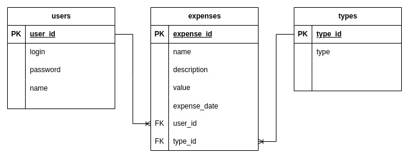

# Despesas App Backend

Sempre gostei de calcular minhas despesas para que não houvesse surpresas no fim do mês e poder controlar meus gastos.

E após concluir o projeto TrybeWallet, me surgiu a ideia de mudar um pouco o funcionamento do projeto, reiniciar do zero tudo, e simular um planejamento de projeto do zero e agora que sei mais sobre backend, tornar a aplicação FullStack.

Eu vou levantar os possíveis requisitos funcionais.

*Obs.: Tive a ideia de migrar para typescricpt no meio do projeto, pra ajudar a habituar com a linguagem.*

## Fluxos;

- Levantar novamente atores e objetos;
- Fazer a normalização;
- Arquitetar o banco de dados;
- Fazer um diagrama ER;
- Construir as migrations, seeds, models;
- Levantamento dos requisitos funcionais da aplicação;
- Distribuir as rotas para cada requisito;
- Criar uma API Rest;
- Trabalhar em cada requisito;
- Acoplar com o projeto frontend;
- Fazer o deploy;

## Tecnologias que pretendo usar:

1. TypeScript;
1. Express;
1. ORM - TypeORM;
    - Dialeto: MySQL;
    - MySQL2;
3. JWT;
4. Lint da trybe para backend;
5. _Outros conforme a necessidade_ ;

## Entidades:

### 1. Usuário

- Nome - `string`;
- Login - `string`;
- Senha - `string`;
### 2. Despesa

- Nome da Despesa - `string`;
- Tipo da Despesa - `[Conta, Cartão, Trabalho, Comida, ..., Lazer, Outros]`;
- Descrição - `string`;
- Valor - `number`;
- Data da despesa* - `date`;

## Diagrama ER
<details>
<summary>Como construi as entidades e relacionamentos.</summary>



</details>
</br>

## Levantamento de Requisitos Funcionais:

1. Criar usuário.
1. Fazer login;
1. Adicionar Despesas;
1. Mostrar "extrato" de despesas;
1. Calcular total de despesas;
1. Excluir despesas;
1. Editar despesas;
1. Filtrar despesas;
1. _Outros conforme surge ideias_ ;

## Levantamento de Requisitos Não Funcionais:

1. Fazer deploy da aplicação.
1. _Outros conforme surge ideias_ ;

### RF01 - Criar usuário;

<details>

<summary>
O que é preciso pra atingir o objetivo do requisito:
</summary>

- criar um endpoint do tipo POST /register;
- O corpo da requisição deverá seguir o formato abaixo:
    ```json
    {
        "login": "fulanoExpress",
        "password": "12345678",
        "name": "Fulano do Express"
    }
    ```
- a cada requisição válida, criar um usuário no banco de dados;
- verificar se todos os campos existem no corpo da requisição, caso não, retornar uma messagem personalizada pra cada coisa faltando. Exemplo:
    ```json
    {
        "error": "FIELD_REQUIRED",
        "message": "\"login\" is required"
    }
    ```
- verificar se todos os campos tem o mínimo de caracteres no corpo da requisição, caso não, retornar uma messagem personalizada pra cada coisa faltando, o campos login, password e name precisam, respectivamente, de 4,8 e 3 caracteres. Exemplo:
    ```json
    {
        "error": "FIELD_MISSING_CARACTHERS",  
        "message": "\"login\" length must be at least 4 characters long"
    }
    ```
 - verificar se o login já existe, caso sim, retornar a messagem e status 409:
    ```json
    {
        "error": "USER_ALREADY_EXISTS",
        "message": "Please try a different login. There is already a user with that login."
    }
    ```
- caso tudo esteja válido, retornar um token gerado pela ferramenta JWT e status 201. Exemplo: 
    ```json
    {
        "token": "xxxxxxxxxxxxxxxxxxxxxxxxxxxxxxxxxxxxxxxxxxxxxxxxxx",
    }
    ```
</details>
